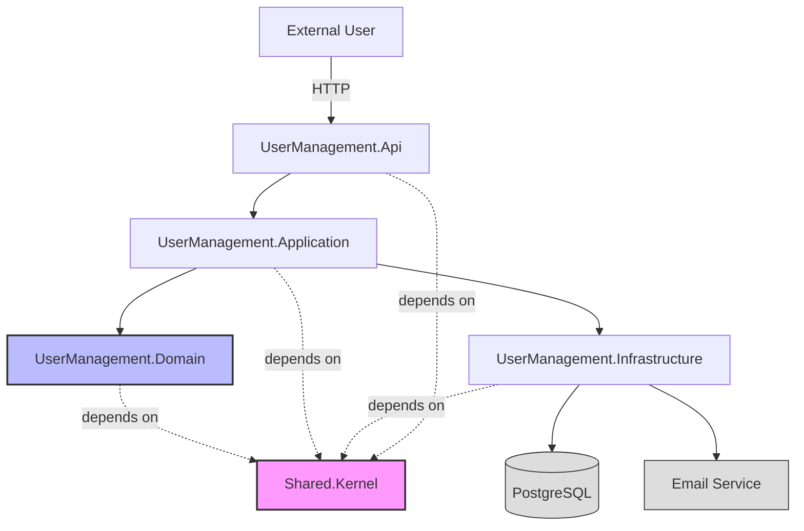
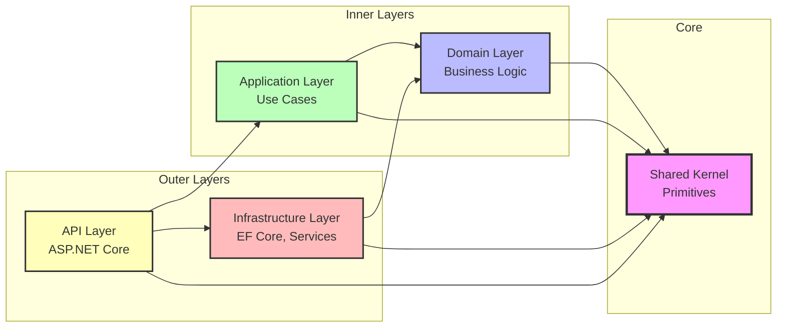
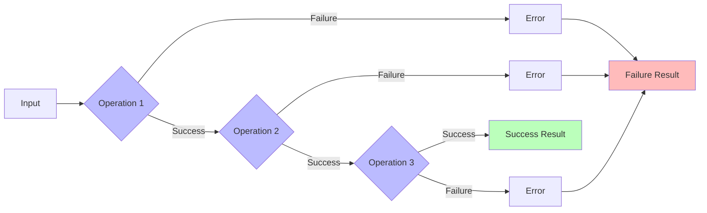

# System Architecture Overview

**Document**: Architecture Overview  
**Audience**: AI Agents, Developers  
**Status**: Living Document  
**Last Updated**: 2025-10-10

---

## Executive Summary

VehicleRegistry is a multi-bounded-context system built using **Clean Architecture**, **Domain-Driven Design**, and **Railway-Oriented Programming**. Currently implementing the UserManagement bounded context with focus on user registration.

### Key Characteristics

- **Architecture**: Clean Architecture (4 layers)
- **Error Handling**: Railway-Oriented Programming with `Result<T>`
- **Domain Model**: Rich domain with Value Objects and Entities
- **Validation**: Atomic, composable validation rules
- **Testing**: Test-Driven Development (TDD)
- **Safety**: NASA-inspired assertions (min 2 per function)
- **Language**: C# 12 with .NET 9.0
- **Immutability**: Records and value types throughout

---

## System Context



---

## Bounded Contexts

### 1. UserManagement (Active Development)

**Responsibility**: User registration, authentication, profile management

**Status**: ✅ Domain Layer Complete

**Components**:
- Domain: Value Objects (Email, Name, PasswordHash), Strongly-Typed IDs
- Validation: 13 atomic email validation rules
- Shared Kernel: Result<T>, Error, RuleComposer

### 2. VehicleRegistry (Planned)

**Responsibility**: Vehicle registration and management

**Status**: ⏳ Not Yet Implemented

---

## Clean Architecture Layers



### Layer Responsibilities

| Layer | Responsibility | Dependencies | Implemented |
|-------|---------------|--------------|-------------|
| **Shared Kernel** | Cross-cutting primitives (Result, Error, interfaces) | None | ✅ Yes |
| **Domain** | Business entities, value objects, domain logic | Shared Kernel | ✅ Yes (UserManagement) |
| **Application** | Use cases, orchestration, validation rules | Domain, Shared Kernel | ⏳ Partial |
| **Infrastructure** | Data access, external services, I/O | Application, Domain | ⏳ No |
| **API** | HTTP endpoints, controllers, middleware | Application, Infrastructure | ⏳ No |

### Dependency Rule

**Core Principle**: Dependencies point inward only.

```
API → Infrastructure → Application → Domain → Shared Kernel
  ↑                                              ↓
  └──────────────────────────────────────────────┘
```

Inner layers **never** reference outer layers.

---

## Railway-Oriented Programming

All operations that can fail return `Result<T>`:



### Result<T> Discriminated Union

```csharp
// Success path
Result<Email> result = EmailFactory.Create("user@example.com");
if (result.IsSuccess) 
{
    Email email = result.Value;
}

// Failure path
if (result.IsFailure)
{
    Error error = result switch
    {
        Failure<Email>(var e) => e,
        _ => throw new InvalidOperationException()
    };
}
```

→ See [02-railway-oriented.md](./02-railway-oriented.md) for details

---

## Domain-Driven Design Patterns

### Value Objects

Immutable records with validation in factory methods:

```csharp
// Email value object
public sealed record Email(string Value);

// Factory with validation
public static class EmailFactory
{
    public static Result<Email> Create(string value)
    {
        // Validation via RuleComposer
        // Returns Result<Email>
    }
}
```

**Implemented Value Objects**:
- `Email` - Email address with 13 validation rules
- `Name` - First and last name (max 100 chars each)
- `PasswordHash` - Hashed password (never stores plain-text)

### Strongly-Typed IDs

Type-safe identifiers preventing ID confusion:

```csharp
public sealed record UserId(Guid Value) : StronglyTypedId<Guid>(Value);
public sealed record UserProfileId(Guid Value) : StronglyTypedId<Guid>(Value);
public sealed record AddressId(Guid Value) : StronglyTypedId<Guid>(Value);
```

Benefits:
- Compile-time safety: Cannot pass `UserId` where `UserProfileId` expected
- Self-documenting code
- Guid.CreateVersion7() for time-ordered IDs

→ See [03-domain-driven-design.md](./03-domain-driven-design.md) for DDD patterns

---

## Validation Architecture

### Atomic Validation Rules

Each rule has single responsibility:

```csharp
public sealed class EmailNotEmptyRule : EmailValidationRuleBase
{
    protected override Result Validate(string value) =>
        string.IsNullOrWhiteSpace(value) 
            ? CreateFailure() 
            : CreateSuccess();
}
```

### Rule Composition

Rules are composed using `RuleComposer<T>`:

```csharp
var emailRules = new RuleComposer<string>([
    new EmailNotEmptyRule(),
    new ExactlyOneAtSymbolRule(),
    new DomainNotEmptyRule(),
    // ... 10 more rules
]);

Result validationResult = emailRules.Validate(emailAddress);
```

**Implemented Rules**: 13 email validation rules

→ See [20-validation-patterns.md](./20-validation-patterns.md) for validation patterns

---

## Testing Strategy

### Test-Driven Development

1. Write failing test first
2. Implement minimal code to pass
3. Refactor while keeping tests green

### Test Coverage

| Component | Tests | Status |
|-----------|-------|--------|
| Shared.Kernel | ✅ All types | 100% |
| Email Validation | ✅ 47 test cases | Django email suite |
| Name Value Object | ✅ 10 tests | All edge cases |
| PasswordHash | ✅ 8 tests | All edge cases |
| Strongly-Typed IDs | ✅ Complete | All types |

### Test Framework

- **xUnit v3** - Test framework
- **AwesomeAssertions** - Fluent assertions
- **Pattern**: No AAA comments, descriptive names

→ See [23-testing-strategy.md](./23-testing-strategy.md) for testing details

---

## NASA Safety Rules Implementation

Every function includes minimum 2 assertions:

```csharp
public static Result<Name> Create(string firstName, string lastName)
{
    Debug.Assert(firstName is not null, "FirstName should not be null");
    Debug.Assert(lastName is not null, "LastName should not be null");
    
    // Validation logic...
    
    Name name = new(firstName, lastName);
    
    Debug.Assert(name.FirstName == firstName, "FirstName should match");
    Debug.Assert(name.LastName == lastName, "LastName should match");
    
    return ResultFactory.Success(name);
}
```

→ See [22-nasa-rules.md](./22-nasa-rules.md) for safety rules

---

## Technology Stack

### Core

- **.NET 9.0** - Runtime platform
- **C# 12** - Programming language
- **xUnit v3** - Testing framework

### Planned (Not Yet Implemented)

- **Entity Framework Core** - ORM
- **PostgreSQL** - Database
- **ASP.NET Core** - Web framework
- **Argon2** - Password hashing

### NuGet Packages

```xml
<PackageReference Include="AwesomeAssertions" Version="9.2.0" />
<PackageReference Include="xunit.v3" Version="3.1.0" />
<!-- More packages in Directory.Packages.props -->
```

---

## Project Structure

```
VehicleRegistry/
├── src/
│   ├── Shared.Kernel/              # ✅ Cross-cutting concerns
│   ├── UserManagement.Domain/      # ✅ Domain model
│   ├── UserManagement.Application/ # ⏳ Use cases
│   ├── UserManagement.Infrastructure/ # ⏳ Data access
│   ├── UserManagement.Api/         # ⏳ HTTP endpoints
│   ├── VehicleRegistry.Domain/     # ⏳ Not started
│   └── VehicleRegistry.Api/        # ⏳ Not started
├── tests/
│   ├── Tests.Shared.Kernel/        # ✅ Unit tests
│   ├── Tests.UserManagement.Domain/ # ✅ Unit tests
│   └── Tests.UserManagement.Application/ # ⏳ Pending
├── .agent/architecture/            # 📚 This documentation
└── tasks/                          # 📋 Task tracking
```

---

## Implementation Roadmap

### Completed ✅

- [x] Shared Kernel (Result, Error, interfaces)
- [x] Strongly-Typed IDs (UserId, UserProfileId, AddressId)
- [x] Email Value Object with 13 validation rules
- [x] Name Value Object
- [x] PasswordHash Value Object

### In Progress 🔄

- [ ] UserRole Value Object (static instances)
- [ ] VerificationToken Value Object
- [ ] Address component Value Objects
- [ ] Entity implementations (User, UserProfile, Address)

### Planned ⏳

- [ ] Application Layer (Use Cases)
- [ ] Infrastructure Layer (EF Core, Repositories)
- [ ] API Layer (Controllers, Middleware)
- [ ] Integration Tests

---

## Key Design Decisions

### 1. Railway-Oriented Programming

**Decision**: Use `Result<T>` instead of exceptions for expected failures

**Rationale**:
- Explicit error handling in type system
- Prevents exception-based control flow
- Clear success/failure paths
- Composable operations

### 2. Atomic Validation Rules

**Decision**: Single-responsibility validation rules composed via `RuleComposer<T>`

**Rationale**:
- Testable in isolation
- Reusable across contexts
- Clear failure messages
- Fail-fast behavior

### 3. Factory Pattern for Value Objects

**Decision**: Private constructors, public static `Create()` factories

**Rationale**:
- Validation before construction
- Impossible to create invalid objects
- Return `Result<T>` for error handling
- NASA assertions for pre/postconditions

### 4. Records for Value Objects

**Decision**: Use `record` with primary constructors

**Rationale**:
- Immutability by default
- Value equality semantics
- Concise syntax
- Pattern matching support

### 5. Strongly-Typed IDs

**Decision**: Wrap Guid in type-safe records

**Rationale**:
- Prevent ID confusion
- Self-documenting code
- Compile-time safety
- Guid.CreateVersion7() support

→ See [32-decision-log.md](./32-decision-log.md) for full decision log

---

## Next Steps

1. **Complete Domain Layer**
   - UserRole value object
   - VerificationToken value object
   - Address components
   - Entity implementations

2. **Application Layer**
   - RegisterUser use case
   - Request/Response DTOs
   - Handler implementation

3. **Infrastructure Layer**
   - EF Core DbContext
   - Repository implementations
   - Argon2 password hasher

4. **API Layer**
   - Controllers
   - Middleware
   - API documentation

---

## Related Documentation

- **Layer Details**
  - [Shared Kernel](./10-shared-kernel.md) - Core primitives
  - [Domain Layer](./11-domain-layer.md) - Business logic
  
- **Patterns**
  - [Railway-Oriented](./02-railway-oriented.md) - Error handling
  - [Validation Patterns](./20-validation-patterns.md) - Validation architecture
  - [Factory Patterns](./21-factory-patterns.md) - Object creation

- **Reference**
  - [Type Catalog](./30-type-catalog.md) - All types
  - [Code Examples](./31-code-examples.md) - Implementation examples

---

**Note**: This document provides a high-level overview. See linked documents for implementation details.
