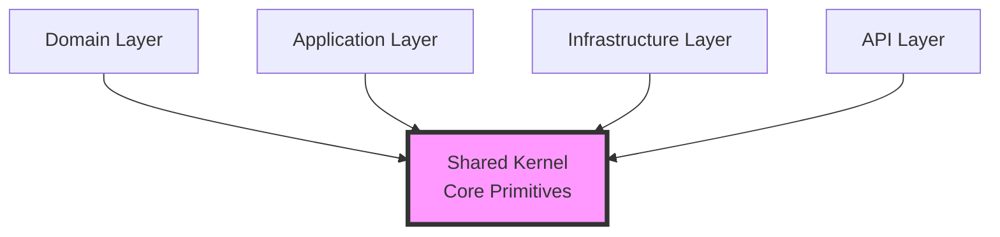
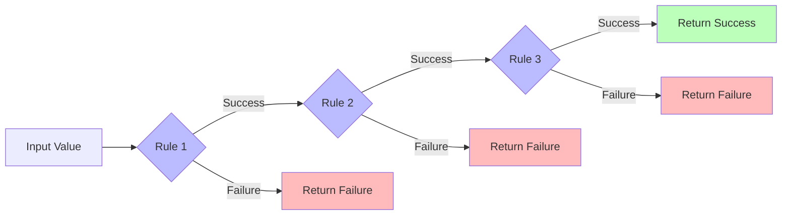
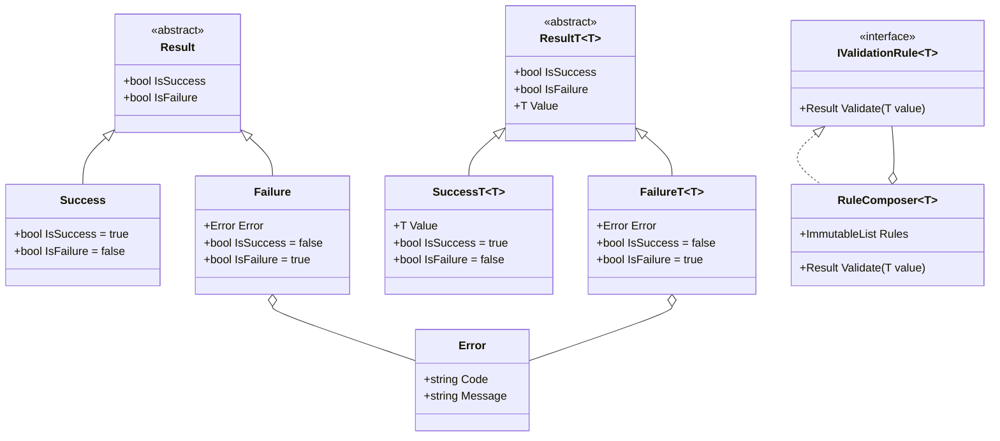

# Shared Kernel Layer

**Document**: Shared Kernel Implementation  
**Layer**: Core Foundation  
**Status**: ✅ Complete  
**Last Updated**: 2025-10-10

---

## Purpose

The Shared Kernel contains cross-cutting concerns and primitives used across all bounded contexts. It has **no external dependencies** and defines the fundamental building blocks of the system.

---

## Layer Position



**Rule**: All layers depend on Shared Kernel. Shared Kernel depends on nothing.

---

## Components

### 1. Result Types (Railway-Oriented Programming)

#### Result (Non-Generic)

Represents operation outcome without return value.

```csharp
// Base abstract record
public abstract record Result
{
    public abstract bool IsSuccess { get; }
    public abstract bool IsFailure { get; }
}

// Success variant
public sealed record Success : Result
{
    public override bool IsSuccess => true;
    public override bool IsFailure => false;
}

// Failure variant
public sealed record Failure(Error Error) : Result
{
    public override bool IsSuccess => false;
    public override bool IsFailure => true;
}
```

**Pattern**: Discriminated union with two variants

**Usage**:

```csharp
// Validation that doesn't return a value
Result result = ruleComposer.Validate(input);

if (result.IsFailure)
{
    Error error = result switch
    {
        Failure(var e) => e,
        _ => throw new InvalidOperationException()
    };
}
```

#### Result<T> (Generic)

Represents operation outcome with return value on success.

```csharp
// Base abstract record
public abstract record Result<T>
{
    public abstract bool IsSuccess { get; }
    public abstract bool IsFailure { get; }
    
    // Throws if accessed on Failure
    public abstract T Value { get; }
}

// Success variant with value
public sealed record Success<T>(T Value) : Result<T>
{
    public override bool IsSuccess => true;
    public override bool IsFailure => false;
    public override T Value { get; } = Value;
}

// Failure variant with error
public sealed record Failure<T>(Error Error) : Result<T>
{
    public override bool IsSuccess => false;
    public override bool IsFailure => true;
    
    public override T Value => 
        throw new InvalidOperationException(
            "Cannot access Value on Failure result");
}
```

**Pattern**: Discriminated union with value on success path

**Usage**:

```csharp
Result<Email> result = EmailFactory.Create("user@example.com");

// Pattern matching for safe access
Email email = result switch
{
    Success<Email>(var value) => value,
    Failure<Email>(var error) => throw new Exception(error.Message),
    _ => throw new InvalidOperationException()
};

// Or conditional check
if (result.IsSuccess)
{
    Email email = result.Value; // Safe to access
}
```

#### ResultFactory

Factory for creating Result instances with NASA assertions.

```csharp
public static class ResultFactory
{
    // Non-generic Success
    public static Result Success()
    {
        Result result = new Success();
        
        Debug.Assert(result.IsSuccess, "Success result must have IsSuccess == true");
        Debug.Assert(!result.IsFailure, "Success result must have IsFailure == false");
        
        return result;
    }
    
    // Non-generic Failure
    public static Result Failure(Error error)
    {
        Debug.Assert(error is not null, "Error cannot be null");
        
        Result result = new Failure(error);
        
        Debug.Assert(!result.IsSuccess, "Failure must have IsSuccess == false");
        Debug.Assert(result.IsFailure, "Failure must have IsFailure == true");
        
        return result;
    }
    
    // Generic Success with value
    public static Result<T> Success<T>(T value)
    {
        Debug.Assert(value is not null, "Value cannot be null");
        
        Result<T> result = new Success<T>(value);
        
        Debug.Assert(result.IsSuccess, "Success must have IsSuccess == true");
        Debug.Assert(!result.IsFailure, "Success must have IsFailure == false");
        
        return result;
    }
    
    // Generic Failure with error
    public static Result<T> Failure<T>(Error error)
    {
        Debug.Assert(error is not null, "Error cannot be null");
        
        Result<T> result = new Failure<T>(error);
        
        Debug.Assert(!result.IsSuccess, "Failure must have IsSuccess == false");
        Debug.Assert(result.IsFailure, "Failure must have IsFailure == true");
        
        return result;
    }
}
```

**Guarantees**:

- Result instances always created via factory
- NASA assertions verify invariants
- Null errors impossible
- Consistent state

---

### 2. Error Type

Immutable error value object.

```csharp
public sealed record Error(string Code, string Message);
```

**Properties**:

- `Code`: Machine-readable error identifier (e.g., "EMAIL.VALIDATION")
- `Message`: Human-readable error description

#### ErrorFactory

Factory for creating Error instances.

```csharp
public static class ErrorFactory
{
    // Generic error
    public static Error Create(string code, string message) =>
        new Error(code, message);
    
    // Validation error (standardized format)
    public static Error Validation(string field, string message) =>
        Create($"{field.ToUpperInvariant()}.Validation", message);
}
```

**Usage**:

```csharp
// Generic error
Error error = ErrorFactory.Create("EMAIL.INVALID", "Email format is invalid");

// Validation error (standardized)
Error validationError = ErrorFactory.Validation("Email", "Cannot be empty");
// Produces: Code = "EMAIL.Validation", Message = "Cannot be empty"
```

**Convention**: Validation errors use `ErrorFactory.Validation()` for consistency.

---

### 3. Validation Interfaces

#### IValidationRule<T>

Single-responsibility validation rule interface.

```csharp
public interface IValidationRule<in TRuleFor>
{
    Result Validate(TRuleFor value);
}
```

**Contract**:

- Input: Value of type `TRuleFor`
- Output: `Result` (success or failure)
- Responsibility: Single validation concern

**Implementation Pattern**:

```csharp
public sealed class EmailNotEmptyRule : IValidationRule<string>
{
    public Result Validate(string value)
    {
        if (string.IsNullOrWhiteSpace(value))
        {
            Error error = ErrorFactory.Validation(
                "Email", 
                "Email cannot be empty");
            return ResultFactory.Failure(error);
        }
        
        return ResultFactory.Success();
    }
}
```

#### RuleComposer<T>

Composes multiple validation rules with fail-fast behavior.

```csharp
public sealed record RuleComposer<TRuleFor>(
    ImmutableList<IValidationRule<TRuleFor>> Rules
) : IValidationRule<TRuleFor>
{
    public Result Validate(TRuleFor value)
    {
        foreach (IValidationRule<TRuleFor> rule in Rules)
        {
            Result result = rule.Validate(value);
            
            if (result.IsFailure)
            {
                return result; // Fail fast
            }
        }
        
        return ResultFactory.Success();
    }
}
```

**Behavior**:

- **Fail-fast**: Stops at first failure
- **Composite Pattern**: Treats single rule and composition uniformly
- **Immutable**: Rules list cannot be modified

**Usage**:

```csharp
var emailRules = new RuleComposer<string>([
    new EmailNotEmptyRule(),
    new ExactlyOneAtSymbolRule(),
    new DomainNotEmptyRule()
]);

Result result = emailRules.Validate("user@example.com");
```

**Flow**:



---

### 4. Request Handler Interface

Generic handler interface for use cases (Application Layer).

```csharp
public interface IRequestHandler<in TRequest, TResponse>
{
    Task<Result<TResponse>> HandleAsync(TRequest request);
}
```

**Contract**:

- Input: Request DTO
- Output: `Task<Result<TResponse>>` (async operation)
- Responsibility: Single use case

**Usage** (planned in Application Layer):

```csharp
public sealed class RegisterUserHandler 
    : IRequestHandler<RegisterUserRequest, RegisterUserResponse>
{
    public async Task<Result<RegisterUserResponse>> HandleAsync(
        RegisterUserRequest request)
    {
        // Use case implementation
    }
}
```

---

### 5. StronglyTypedId<T>

Base record for type-safe IDs.

```csharp
public abstract record StronglyTypedId<T>(T Value) where T : notnull
{
    public T Value { get; } = Value;
}
```

**Purpose**:

- Prevent ID confusion (e.g., UserId vs UserProfileId)
- Type-safe by design
- Value equality semantics

**Usage** (in Domain Layer):

```csharp
public sealed record UserId(Guid Value) : StronglyTypedId<Guid>(Value);
public sealed record UserProfileId(Guid Value) : StronglyTypedId<Guid>(Value);

// Compile-time safety
UserId userId = new(Guid.CreateVersion7());
UserProfileId profileId = new(Guid.CreateVersion7());

// Won't compile: types are incompatible
// void DoSomething(UserId id) { }
// DoSomething(profileId); // ERROR!
```

---

## Type Relationships



---

## Design Patterns

### 1. Discriminated Union

Both `Result` and `Result<T>` are discriminated unions:

```csharp
// Pattern matching
var message = result switch
{
    Success => "Operation succeeded",
    Failure(var error) => $"Failed: {error.Message}",
    _ => throw new InvalidOperationException()
};
```

### 2. Factory Pattern

All Result and Error instances created via factories:

```csharp
// Never: new Success()
// Always: ResultFactory.Success()

// Never: new Error("CODE", "Message")
// Always: ErrorFactory.Create("CODE", "Message")
```

### 3. Composite Pattern

`RuleComposer<T>` treats single rules and compositions uniformly:

```csharp
IValidationRule<string> singleRule = new EmailNotEmptyRule();
IValidationRule<string> composed = new RuleComposer<string>([
    new EmailNotEmptyRule(),
    new ExactlyOneAtSymbolRule()
]);

// Both implement same interface
Result result1 = singleRule.Validate(input);
Result result2 = composed.Validate(input);
```

### 4. Template Method (Base Classes for Rules)

Domain layer extends with base classes:

```csharp
// In Domain Layer
public abstract class EmailValidationRuleBase : IValidationRule<string>
{
    protected abstract string ErrorCode { get; }
    protected abstract string ErrorMessage { get; }
    
    protected abstract Result Validate(string value);
    
    protected Result CreateSuccess() => ResultFactory.Success();
    protected Result CreateFailure() => 
        ResultFactory.Failure(ErrorFactory.Create(ErrorCode, ErrorMessage));
    
    Result IValidationRule<string>.Validate(string value) => Validate(value);
}
```

---

## Invariants & Guarantees

### Result Invariants

1. **Exactly one state**: Either Success or Failure, never both
2. **Value safety**: `Value` property throws on Failure
3. **Non-null errors**: Failure always has non-null Error
4. **Factory creation**: All instances via factory (assertions enforced)

### Validation Invariants

1. **Fail-fast**: RuleComposer stops at first failure
2. **Single responsibility**: Each rule tests one concern
3. **Immutability**: Rules and composers are immutable
4. **Consistency**: Validation is deterministic

### Error Invariants

1. **Non-empty code**: Error code cannot be empty
2. **Non-empty message**: Error message cannot be empty
3. **Validation format**: `ErrorFactory.Validation()` produces `"{FIELD}.Validation"`

---

## Usage Examples

### Example 1: Value Object Creation

```csharp
// Factory attempts to create Email
public static Result<Email> Create(string value)
{
    // Validate using RuleComposer
    var rules = new RuleComposer<string>([
        new EmailNotEmptyRule(),
        new ExactlyOneAtSymbolRule()
    ]);
    
    Result validationResult = rules.Validate(value);
    
    if (validationResult.IsFailure)
    {
        Error error = validationResult switch
        {
            Failure(var e) => e,
            _ => throw new InvalidOperationException()
        };
        return ResultFactory.Failure<Email>(error);
    }
    
    Email email = new(value);
    return ResultFactory.Success(email);
}
```

### Example 2: Chaining Operations

```csharp
Result<Email> emailResult = EmailFactory.Create(input);
if (emailResult.IsFailure) return emailResult; // Propagate failure

Result<Name> nameResult = NameFactory.Create(firstName, lastName);
if (nameResult.IsFailure) return nameResult; // Propagate failure

// Both succeeded, continue...
```

### Example 3: Error Handling

```csharp
Result<Email> result = EmailFactory.Create("invalid");

if (result.IsFailure)
{
    Error error = result switch
    {
        Failure<Email>(var e) => e,
        _ => Assert.Fail("Expected Failure")
    };
    
    Console.WriteLine($"Error {error.Code}: {error.Message}");
    // Output: "Error EMAIL.Validation: Email cannot be empty"
}
```

---

## Testing

All Shared Kernel types have comprehensive tests:

- **ResultTests.cs**: Non-generic Result
- **ResultTTests.cs**: Generic Result<T>
- **ValidationRuleTests.cs**: IValidationRule<T>
- **RuleComposerTests.cs**: RuleComposer<T>
- **RequestHandlerTests.cs**: IRequestHandler<TRequest, TResponse>

**Coverage**: 100% of implemented types

---

## Dependencies

**External**: None

**Internal**: None (this is the foundation layer)

---

## Files

| File | Types | Status |
|------|-------|--------|
| `Results/Result.cs` | Result, Success, Failure, ResultFactory | ✅ Complete |
| `Results/Result{T}.cs` | Result<T>, Success<T>, Failure<T> | ✅ Complete |
| `Results/Error.cs` | Error, ErrorFactory | ✅ Complete |
| `Abstractions/IValidationRule.cs` | IValidationRule<T> | ✅ Complete |
| `Validation/RuleComposer.cs` | RuleComposer<T> | ✅ Complete |
| `Abstractions/IRequestHandler.cs` | IRequestHandler<TRequest, TResponse> | ✅ Complete |
| `Common/StronglyTypedId.cs` | StronglyTypedId<T> | ✅ Complete |

---

## Related Documentation

- [Railway-Oriented Programming](./02-railway-oriented.md) - Result<T> patterns
- [Domain Layer](./11-domain-layer.md) - Uses Shared Kernel primitives
- [Validation Patterns](./20-validation-patterns.md) - RuleComposer usage
- [Type Catalog](./30-type-catalog.md) - Complete type reference

---

**Next**: See [Domain Layer](./11-domain-layer.md) for how these primitives are used to build the domain model.
