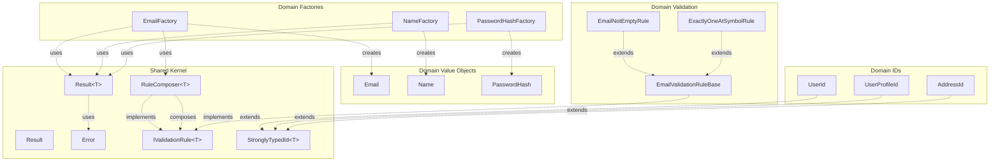

# Type Catalog

**Document**: Complete Type Reference  
**Purpose**: AI-Agent reference for all types in the codebase  
**Status**: ✅ Current Implementation Only  
**Last Updated**: 2025-10-10

---

## Quick Reference

### Shared Kernel (Foundation)

| Type | Category | File | Purpose |
|------|----------|------|---------|
| `Result` | Discriminated Union | `Results/Result.cs` | Non-generic operation outcome |
| `Success` | Record | `Results/Result.cs` | Success variant of Result |
| `Failure` | Record | `Results/Result.cs` | Failure variant with Error |
| `Result<T>` | Discriminated Union | `Results/Result{T}.cs` | Generic operation outcome with value |
| `Success<T>` | Record | `Results/Result{T}.cs` | Success variant with value |
| `Failure<T>` | Record | `Results/Result{T}.cs` | Failure variant with Error |
| `Error` | Record | `Results/Error.cs` | Immutable error value object |
| `ResultFactory` | Static Class | `Results/Result.cs` | Factory for Result instances |
| `ErrorFactory` | Static Class | `Results/Error.cs` | Factory for Error instances |
| `IValidationRule<T>` | Interface | `Abstractions/IValidationRule.cs` | Single validation rule contract |
| `RuleComposer<T>` | Record | `Validation/RuleComposer.cs` | Composite validation rules |
| `IRequestHandler<TRequest, TResponse>` | Interface | `Abstractions/IRequestHandler.cs` | Use case handler contract |
| `StronglyTypedId<T>` | Abstract Record | `Common/StronglyTypedId.cs` | Base for type-safe IDs |

### UserManagement Domain

#### Strongly-Typed IDs

| Type | Base Type | File | Purpose |
|------|-----------|------|---------|
| `UserId` | `StronglyTypedId<Guid>` | `ValueObjects/UserId.cs` | User aggregate ID |
| `UserProfileId` | `StronglyTypedId<Guid>` | `ValueObjects/UserProfileId.cs` | UserProfile entity ID |
| `AddressId` | `StronglyTypedId<Guid>` | `ValueObjects/AddressId.cs` | Address entity ID |

#### Value Objects

| Type | Properties | File | Validation |
|------|-----------|------|-----------|
| `Email` | `string Value` | `ValueObjects/Email.cs` | 13 atomic rules via RuleComposer |
| `Name` | `string FirstName, string LastName` | `ValueObjects/Name.cs` | Max 100 chars, not empty |
| `PasswordHash` | `string Value` | `ValueObjects/PasswordHash.cs` | Not empty (stores hashed) |

#### Validation Rules (Email)

| Rule | File | Validates |
|------|------|-----------|
| `EmailValidationRuleBase` | `Validation/Email/EmailValidationRuleBase.cs` | Abstract base with template method |
| `EmailNotEmptyRule` | `Validation/Email/EmailNotEmptyRule.cs` | Not null/whitespace |
| `ExactlyOneAtSymbolRule` | `Validation/Email/ExactlyOneAtSymbolRule.cs` | Exactly one @ symbol |
| `DomainNotEmptyRule` | `Validation/Email/DomainNotEmptyRule.cs` | Domain part not empty |
| `LocalPartMaxLengthRule` | `Validation/Email/LocalPartMaxLengthRule.cs` | Local ≤ 64 chars (RFC 5321) |
| `DomainPartMaxLengthRule` | `Validation/Email/DomainPartMaxLengthRule.cs` | Domain ≤ 255 chars (RFC 5321) |
| `NoWhitespaceRule` | `Validation/Email/NoWhitespaceRule.cs` | No whitespace in email |
| `NoNewlineCharactersRule` | `Validation/Email/NoNewlineCharactersRule.cs` | No \n or \r |
| `NoTrailingDotRule` | `Validation/Email/NoTrailingDotRule.cs` | Cannot end with dot |
| `NoUnderscoreInDomainRule` | `Validation/Email/NoUnderscoreInDomainRule.cs` | No _ in domain |
| `ValidDomainHyphensRule` | `Validation/Email/ValidDomainHyphensRule.cs` | Labels cannot start/end with - |
| `DomainLabelMaxLengthRule` | `Validation/Email/DomainLabelMaxLengthRule.cs` | Label ≤ 63 chars (RFC 1034) |
| `DomainNotStartWithDotRule` | `Validation/Email/DomainNotStartWithDotRule.cs` | Domain cannot start with dot |
| `NoConsecutiveDotsInDomainRule` | `Validation/Email/NoConsecutiveDotsInDomainRule.cs` | No ".." in domain |

#### Factories

| Factory | Creates | File | Returns |
|---------|---------|------|---------|
| `EmailFactory` | `Email` | `ValueObjects/Email.cs` | `Result<Email>` |
| `NameFactory` | `Name` | `ValueObjects/Name.cs` | `Result<Name>` |
| `PasswordHashFactory` | `PasswordHash` | `ValueObjects/PasswordHash.cs` | `Result<PasswordHash>` |

---

## Type Relationships



---

## Detailed Type Signatures

### Shared Kernel

```csharp
// Result (non-generic)
public abstract record Result
{
    public abstract bool IsSuccess { get; }
    public abstract bool IsFailure { get; }
}

public sealed record Success : Result;
public sealed record Failure(Error Error) : Result;

// Result<T> (generic)
public abstract record Result<T>
{
    public abstract bool IsSuccess { get; }
    public abstract bool IsFailure { get; }
    public abstract T Value { get; }
}

public sealed record Success<T>(T Value) : Result<T>;
public sealed record Failure<T>(Error Error) : Result<T>;

// Error
public sealed record Error(string Code, string Message);

// Validation
public interface IValidationRule<in TRuleFor>
{
    Result Validate(TRuleFor value);
}

public sealed record RuleComposer<TRuleFor>(
    ImmutableList<IValidationRule<TRuleFor>> Rules
) : IValidationRule<TRuleFor>;

// Request Handler
public interface IRequestHandler<in TRequest, TResponse>
{
    Task<Result<TResponse>> HandleAsync(TRequest request);
}

// Strongly-Typed ID
public abstract record StronglyTypedId<T>(T Value) where T : notnull;
```

### UserManagement Domain

```csharp
// Strongly-Typed IDs
public sealed record UserId(Guid Value) : StronglyTypedId<Guid>(Value);
public sealed record UserProfileId(Guid Value) : StronglyTypedId<Guid>(Value);
public sealed record AddressId(Guid Value) : StronglyTypedId<Guid>(Value);

// Value Objects
public sealed record Email(string Value);
public sealed record Name(string FirstName, string LastName);
public sealed record PasswordHash(string Value);

// Factories
public static class EmailFactory
{
    public static Result<Email> Create(string value);
}

public static class NameFactory
{
    public static Result<Name> Create(string firstName, string lastName);
}

public static class PasswordHashFactory
{
    public static Result<PasswordHash> Create(string hash);
}

// Validation Base
public abstract class EmailValidationRuleBase : IValidationRule<string>
{
    protected abstract string ErrorCode { get; }
    protected abstract string ErrorMessage { get; }
    protected abstract Result Validate(string value);
    protected Result CreateSuccess();
    protected Result CreateFailure();
}

// Validation Rules (13 rules inherit from base)
public sealed class EmailNotEmptyRule : EmailValidationRuleBase { }
public sealed class ExactlyOneAtSymbolRule : EmailValidationRuleBase { }
// ... 11 more rules
```

---

## Type Categories

### By Mutability

**Immutable** (Records):
- All Value Objects (Email, Name, PasswordHash)
- All Strongly-Typed IDs (UserId, UserProfileId, AddressId)
- All Result types (Result, Success, Failure, Result<T>, Success<T>, Failure<T>)
- Error
- RuleComposer<T>

**Abstract**:
- Result
- Result<T>
- StronglyTypedId<T>
- EmailValidationRuleBase

### By Layer

**Shared Kernel** (7 types + 2 factories):
- Result types (6)
- Error (1)
- Interfaces (2)
- StronglyTypedId<T> (1)
- Factories (2)

**Domain** (3 value objects + 3 IDs + 13 validation rules + 3 factories):
- Value Objects (3)
- Strongly-Typed IDs (3)
- Validation Rules (13 + 1 base)
- Factories (3)

### By Purpose

**Error Handling**:
- Result, Success, Failure
- Result<T>, Success<T>, Failure<T>
- Error

**Validation**:
- IValidationRule<T>
- RuleComposer<T>
- EmailValidationRuleBase
- 13 Email validation rules

**Domain Model**:
- Email, Name, PasswordHash (Value Objects)
- UserId, UserProfileId, AddressId (Strongly-Typed IDs)

**Object Creation**:
- EmailFactory, NameFactory, PasswordHashFactory
- ResultFactory, ErrorFactory

---

## Usage Patterns

### Creating Value Objects

```csharp
// All value objects created via factories
Result<Email> emailResult = EmailFactory.Create("user@example.com");
Result<Name> nameResult = NameFactory.Create("John", "Doe");
Result<PasswordHash> hashResult = PasswordHashFactory.Create(hashedPassword);
```

### Handling Results

```csharp
// Pattern matching
Email email = result switch
{
    Success<Email>(var value) => value,
    Failure<Email>(var error) => throw new Exception(error.Message),
    _ => throw new InvalidOperationException()
};

// Conditional
if (result.IsSuccess)
{
    Email email = result.Value;
}
```

### Composing Validation

```csharp
var rules = new RuleComposer<string>([
    new EmailNotEmptyRule(),
    new ExactlyOneAtSymbolRule(),
    new DomainNotEmptyRule()
]);

Result validationResult = rules.Validate(input);
```

---

## File Locations

### Shared Kernel

```
src/Shared.Kernel/
├── Abstractions/
│   ├── IRequestHandler.cs
│   └── IValidationRule.cs
├── Common/
│   └── StronglyTypedId.cs
├── Results/
│   ├── Error.cs
│   ├── Result.cs
│   └── Result{T}.cs
└── Validation/
    └── RuleComposer.cs
```

### UserManagement Domain

```
src/UserManagement.Domain/
├── ValueObjects/
│   ├── AddressId.cs
│   ├── Email.cs
│   ├── Name.cs
│   ├── PasswordHash.cs
│   ├── UserId.cs
│   └── UserProfileId.cs
└── Validation/
    └── Email/
        ├── EmailValidationRuleBase.cs
        ├── EmailNotEmptyRule.cs
        ├── ExactlyOneAtSymbolRule.cs
        ├── DomainNotEmptyRule.cs
        ├── LocalPartMaxLengthRule.cs
        ├── DomainPartMaxLengthRule.cs
        ├── NoWhitespaceRule.cs
        ├── NoNewlineCharactersRule.cs
        ├── NoTrailingDotRule.cs
        ├── NoUnderscoreInDomainRule.cs
        ├── ValidDomainHyphensRule.cs
        ├── DomainLabelMaxLengthRule.cs
        ├── DomainNotStartWithDotRule.cs
        └── NoConsecutiveDotsInDomainRule.cs
```

---

## Type Dependencies

### No Dependencies

- Error
- StronglyTypedId<T>
- IValidationRule<T>
- IRequestHandler<TRequest, TResponse>

### Depends on Error

- Result (Failure variant)
- Result<T> (Failure<T> variant)

### Depends on IValidationRule<T>

- RuleComposer<T> (implements and composes)
- EmailValidationRuleBase (implements)

### Depends on Result<T>

- All factories (return Result<T>)

---

**Next**: See [Code Examples](./31-code-examples.md) for concrete usage patterns.
