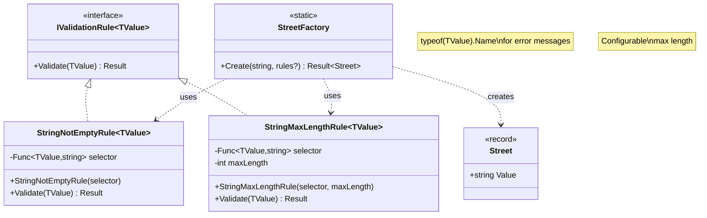

# Generic Validation Rules Pattern

**Created:** 2025-10-10  
**Related:** [Address Components Refactored](./tasks/2.20-2.21-address-components-REFACTORED.md), [Email Refactored](./tasks/2.08-2.11-email-REFACTORED.md)

---

## Overview

Generic, reusable validation rules that eliminate code duplication across value object factories while maintaining type safety through `IValidationRule<TValue>`.

**Key Concepts:**

- **Generic Type Parameter:** `<TValue>` allows same rule to work for different value objects
- **Selector Function:** `Func<TValue, string>` extracts the property to validate
- **Runtime Type Names:** `typeof(TValue).Name` provides actual type name in error messages
- **Composability:** Rules combined via `RuleComposer<TValue>`

---

## Architecture



---

## Rules

### 1. StringNotEmptyRule&lt;TValue&gt;

**File:** `src/UserManagement.Domain/Validation/Common/StringNotEmptyRule.cs`

**Purpose:** Validates that a string property is not null, empty, or whitespace

**Implementation:**

```csharp
using Shared.Kernel;

namespace UserManagement.Domain.Validation.Common;

public sealed class StringNotEmptyRule<TValue>(Func<TValue, string> selector) 
    : IValidationRule<TValue>
    where TValue : class
{
    public Result Validate(TValue value)
    {
        string input = selector.Invoke(value);

        if (string.IsNullOrWhiteSpace(input))
            return ResultFactory.Failure(
                ErrorFactory.Validation(
                    typeof(TValue).Name,
                    $"{typeof(TValue).Name} cannot be empty"
                )
            );

        return ResultFactory.Success();
    }
}
```

**Key Features:**

- **Generic Type Parameter:** Works with any `class` type
- **Selector Function:** Extracts string property from value object
- **Runtime Type Name:** `typeof(TValue).Name` provides "Street", "City", etc.
- **Consistent Errors:** Always `{TypeName}.Validation` code

**Usage Examples:**

```csharp
// Street value object
var rule = new StringNotEmptyRule<Street>(s => s.Value);
Result result = rule.Validate(new Street("Main St")); // Success
Result result = rule.Validate(new Street("")); // Failure: "Street cannot be empty"

// City value object
var rule = new StringNotEmptyRule<City>(c => c.Value);
Result result = rule.Validate(new City("New York")); // Success
Result result = rule.Validate(new City("   ")); // Failure: "City cannot be empty"

// Email value object
var rule = new StringNotEmptyRule<Email>(e => e.Value);
Result result = rule.Validate(new Email("test@example.com")); // Success
```

**Error Format:**

- **Code:** `{TypeName}.Validation` (e.g., `STREET.Validation`, `CITY.Validation`)
- **Message:** `"{TypeName} cannot be empty"` (e.g., `"Street cannot be empty"`)

---

### 2. StringMaxLengthRule&lt;TValue&gt;

**File:** `src/UserManagement.Domain/Validation/Common/StringMaxLengthRule.cs`

**Purpose:** Validates that a string property does not exceed maximum length

**Implementation:**

```csharp
using Shared.Kernel;

namespace UserManagement.Domain.Validation.Common;

public sealed class StringMaxLengthRule<TValue>(
    Func<TValue, string> selector,
    int maxLength) 
    : IValidationRule<TValue>
    where TValue : class
{
    public Result Validate(TValue value)
    {
        string input = selector.Invoke(value);

        if (input.Length > maxLength)
            return ResultFactory.Failure(
                ErrorFactory.Validation(
                    typeof(TValue).Name,
                    $"{typeof(TValue).Name} cannot exceed maximum length of {maxLength} characters"
                )
            );

        return ResultFactory.Success();
    }
}
```

**Key Features:**

- **Configurable Max Length:** Different limits for different value objects
- **Generic Type Parameter:** Reusable across all value objects
- **Selector Function:** Extracts string property
- **Clear Error Messages:** Includes actual max length in message

**Usage Examples:**

```csharp
// Street (max 200 characters)
var rule = new StringMaxLengthRule<Street>(s => s.Value, 200);
Result result = rule.Validate(new Street(new string('a', 200))); // Success
Result result = rule.Validate(new Street(new string('a', 201))); // Failure

// City (max 100 characters)
var rule = new StringMaxLengthRule<City>(c => c.Value, 100);
Result result = rule.Validate(new City("New York")); // Success

// PostalCode (max 20 characters)
var rule = new StringMaxLengthRule<PostalCode>(p => p.Value, 20);
Result result = rule.Validate(new PostalCode("SW1A 1AA")); // Success
```

**Error Format:**

- **Code:** `{TypeName}.Validation`
- **Message:** `"{TypeName} cannot exceed maximum length of {maxLength} characters"`

**Special Behavior:**

- Empty strings are **allowed** (validated by `StringNotEmptyRule`)
- Only checks length, not content format

---

## Usage Pattern in Factories

### Standard Factory Implementation

```csharp
public static class StreetFactory
{
    private const int MaxLength = 200;

    public static Result<Street> Create(string value, IValidationRule<Street>[]? rules = null)
    {
        // 1. Create value object first
        Street street = new(value);

        // 2. Provide default rules if none supplied
        rules ??= [
            new StringNotEmptyRule<Street>(s => s.Value),
            new StringMaxLengthRule<Street>(s => s.Value, MaxLength)
        ];

        // 3. Assert rules provided
        Debug.Assert(rules.Length > 0, "At least 1 validation rule must be provided");

        // 4. Compose and validate
        RuleComposer<Street> composedRule = RuleComposerFactory.Create(rules);
        Result validationResult = composedRule.Validate(street);

        // 5. Handle failure
        if (validationResult is Failure failure)
        {
            Result<Street> failureResult = ResultFactory.Failure<Street>(failure.Error);
            Debug.Assert(failureResult.IsFailure, "Result should be a failure");
            return failureResult;
        }

        // 6. NASA assertions (post-conditions)
        Debug.Assert(
            !string.IsNullOrWhiteSpace(street.Value),
            "Street value must not be empty after creation"
        );
        Debug.Assert(
            street.Value.Length <= MaxLength,
            "Street value must not exceed maximum length after creation"
        );

        // 7. Return success
        Result<Street> success = ResultFactory.Success(street);
        Debug.Assert(success.IsSuccess, "Result should be a success");
        Debug.Assert(success.Value == street, "Result value should be the created street");

        return success;
    }
}
```

### Key Implementation Steps

1. **Create Value Object:** Construct instance immediately (no delay)
2. **Default Rules:** Provide sensible defaults via `??=`
3. **Assertions:** At least 1 rule must be provided
4. **Composition:** Use `RuleComposer` to combine rules
5. **Short-Circuit:** Validation stops at first failure
6. **NASA Assertions:** Verify post-conditions
7. **Success Path:** Return wrapped value object

---

## Benefits

### 1. **Elimination of Code Duplication**

**Before (Repeated 4 Times):**

```csharp
if (string.IsNullOrWhiteSpace(value))
    return CreateError(nameof(Street.Value), "Street cannot be empty");

if (value.Length > MaxLength)
    return CreateError(nameof(Street.Value), 
        $"Street cannot exceed maximum length of {MaxLength} characters");

private static Result<Street> CreateError(string propertyName, string message)
{
    Error error = ErrorFactory.Validation(propertyName, message);
    Result<Street> failure = ResultFactory.Failure<Street>(error);
    Debug.Assert(failure.IsFailure, "Result should be a failure");
    return failure;
}
```

**After (Reusable):**

```csharp
rules ??= [
    new StringNotEmptyRule<Street>(s => s.Value),
    new StringMaxLengthRule<Street>(s => s.Value, MaxLength)
];
```

**Savings:** ~20 lines per factory × 4 factories = ~80 lines eliminated

### 2. **Type Safety**

```csharp
// ✅ Type-safe: Cannot mix value object types
IValidationRule<Street>[] streetRules = [
    new StringNotEmptyRule<Street>(s => s.Value)
];

IValidationRule<City>[] cityRules = [
    new StringNotEmptyRule<City>(c => c.Value)
];

// ❌ Compile error: Cannot assign Street rule to City
cityRules[0] = streetRules[0]; // CS0029: Cannot convert
```

### 3. **Testability**

**Rules Tested in Isolation:**

```csharp
[Fact]
public void Validate_WithEmptyValue_ShouldFail()
{
    // Arrange
    var rule = new StringNotEmptyRule<Street>(s => s.Value);
    var street = new Street("");

    // Act
    Result result = rule.Validate(street);

    // Assert
    result.IsFailure.Should().BeTrue();
}
```

**Value Objects Tested with Default Rules:**

```csharp
[Fact]
public void Create_WithEmptyStreet_ShouldFail()
{
    // Act (uses default rules)
    Result<Street> result = StreetFactory.Create("");

    // Assert
    result.IsFailure.Should().BeTrue();
}
```

### 4. **Reusability**

**Current Usage:**

- Street (max 200)
- City (max 100)
- PostalCode (max 20)
- Country (max 100)

**Future Usage:**

```csharp
// New value object can reuse rules
public sealed record CompanyName(string Value);

public static class CompanyNameFactory
{
    public static Result<CompanyName> Create(
        string value, 
        IValidationRule<CompanyName>[]? rules = null)
    {
        CompanyName company = new(value);

        rules ??= [
            new StringNotEmptyRule<CompanyName>(c => c.Value),
            new StringMaxLengthRule<CompanyName>(c => c.Value, 150)
        ];

        // Same pattern as Street/City/etc.
    }
}
```

### 5. **Extensibility**

**Adding New Rules:**

```csharp
// New rule can be used with existing value objects
public sealed class MinLengthRule<TValue>(
    Func<TValue, string> selector,
    int minLength) 
    : IValidationRule<TValue>
    where TValue : class
{
    public Result Validate(TValue value)
    {
        string input = selector.Invoke(value);

        if (input.Length < minLength)
            return ResultFactory.Failure(
                ErrorFactory.Validation(
                    typeof(TValue).Name,
                    $"{typeof(TValue).Name} must be at least {minLength} characters"
                )
            );

        return ResultFactory.Success();
    }
}

// Usage
rules = [
    new StringNotEmptyRule<Street>(s => s.Value),
    new MinLengthRule<Street>(s => s.Value, 5),  // New rule
    new StringMaxLengthRule<Street>(s => s.Value, 200)
];
```

### 6. **Consistent Error Messages**

All rules use same error format:

- **Code:** `{TypeName}.Validation`
- **Message:** `"{TypeName} {validation message}"`

**Examples:**

- `STREET.Validation` → `"Street cannot be empty"`
- `CITY.Validation` → `"City cannot exceed maximum length of 100 characters"`
- `EMAIL.Validation` → `"Email cannot be empty"`

---

## Design Decisions

### Why typeof(TValue).Name Instead of nameof(TValue)?

**Problem with nameof():**

```csharp
public sealed class StringNotEmptyRule<TValue> : IValidationRule<TValue>
{
    public Result Validate(TValue value)
    {
        return ResultFactory.Failure(
            ErrorFactory.Validation(
                nameof(TValue),  // ❌ Always returns "TValue"
                $"{nameof(TValue)} cannot be empty"  // ❌ Message: "TValue cannot be empty"
            )
        );
    }
}
```

**Solution with typeof().Name:**

```csharp
public sealed class StringNotEmptyRule<TValue> : IValidationRule<TValue>
{
    public Result Validate(TValue value)
    {
        return ResultFactory.Failure(
            ErrorFactory.Validation(
                typeof(TValue).Name,  // ✅ Returns "Street", "City", etc.
                $"{typeof(TValue).Name} cannot be empty"  // ✅ Message: "Street cannot be empty"
            )
        );
    }
}
```

**Result:**

- Runtime type name in error messages
- Clear, specific error codes (e.g., `STREET.Validation`)
- User-friendly error messages

### Why Selector Function Instead of Reflection?

**Alternative: Reflection-Based**

```csharp
// ❌ Slower, less type-safe
public sealed class StringNotEmptyRule<TValue> : IValidationRule<TValue>
{
    private readonly string propertyName;

    public StringNotEmptyRule(string propertyName)
    {
        this.propertyName = propertyName;
    }

    public Result Validate(TValue value)
    {
        var property = typeof(TValue).GetProperty(propertyName);
        string? input = property?.GetValue(value) as string;
        // ...
    }
}
```

**Chosen: Selector Function**

```csharp
// ✅ Faster, type-safe, compile-time checked
public sealed class StringNotEmptyRule<TValue>(Func<TValue, string> selector) 
    : IValidationRule<TValue>
{
    public Result Validate(TValue value)
    {
        string input = selector.Invoke(value);
        // ...
    }
}
```

**Benefits:**

- **Performance:** No reflection overhead
- **Type Safety:** Compiler checks selector at compile time
- **Refactoring Safe:** Rename refactoring updates selector
- **IntelliSense:** Auto-completion for properties
- **Flexibility:** Can use complex selectors (e.g., `e => e.Value.Trim()`)

### Why Optional rules Parameter with Defaults?

**Design:**

```csharp
public static Result<Street> Create(string value, IValidationRule<Street>[]? rules = null)
{
    rules ??= [/* default rules */];
}
```

**Alternative 1: Always Required**

```csharp
// ❌ Verbose for normal usage
public static Result<Street> Create(string value, IValidationRule<Street>[] rules)
{
    // Every call must provide rules
}

// Usage
var result = StreetFactory.Create("Main St", [
    new StringNotEmptyRule<Street>(s => s.Value),
    new StringMaxLengthRule<Street>(s => s.Value, 200)
]); // Too verbose!
```

**Alternative 2: Separate Methods**

```csharp
// ❌ API duplication
public static Result<Street> Create(string value) { /* default rules */ }
public static Result<Street> CreateWithRules(string value, IValidationRule<Street>[] rules) { /* custom */ }
```

**Chosen Approach:**

```csharp
// ✅ Convenience + Flexibility
public static Result<Street> Create(string value, IValidationRule<Street>[]? rules = null)
{
    rules ??= [/* defaults */];
}

// Normal usage (concise)
var result = StreetFactory.Create("Main St");

// Testing (flexible)
var result = StreetFactory.Create("", [new AlwaysValidRule()]);
```

**Benefits:**

- **Convenience:** Most calls use simple signature
- **Flexibility:** Tests can inject custom rules
- **No Duplication:** Single method handles both cases
- **Extensibility:** Future rules don't break existing code

---

## Test Coverage

### Validation Rules Tests

**Location:** `tests/Tests.UserManagement.Domain/Validation/Common/`

#### StringNotEmptyRuleTests (4 tests)

1. ✅ `Validate_WithNonEmptyValue_ShouldSucceed`
2. ✅ `Validate_WithEmptyValue_ShouldFail`
3. ✅ `Validate_WithWhitespaceValue_ShouldFail`
4. ✅ `Validate_WithNullValue_ShouldFail`

#### StringMaxLengthRuleTests (4 tests)

1. ✅ `Validate_WithinMaxLength_ShouldSucceed`
2. ✅ `Validate_AtExactMaxLength_ShouldSucceed`
3. ✅ `Validate_ExceedingMaxLength_ShouldFail`
4. ✅ `Validate_WithEmptyValue_ShouldSucceed` (empty allowed)

**Total:** 8 validation rule tests

### Value Objects Tests

**Locations:**

- `tests/Tests.UserManagement.Domain/ValueObjects/AddressComponents/` (41 tests)
- `tests/Tests.UserManagement.Domain/ValueObjects/EmailTests.cs`
- `tests/Tests.UserManagement.Domain/Validation/Email/EmailValidationRulesTests.cs`

All value object tests use default rules, ensuring integration works correctly.

**Total:** 144 tests passing

---

## Future Enhancements

### 1. Additional Generic Rules

```csharp
// Minimum length validation
public sealed class MinLengthRule<TValue>(
    Func<TValue, string> selector,
    int minLength) : IValidationRule<TValue>

// Regex pattern validation
public sealed class RegexRule<TValue>(
    Func<TValue, string> selector,
    string pattern,
    string errorMessage) : IValidationRule<TValue>

// Custom predicate validation
public sealed class PredicateRule<TValue>(
    Func<TValue, bool> predicate,
    string errorMessage) : IValidationRule<TValue>
```

### 2. Rule Builders

```csharp
// Fluent API for rule composition
public static class ValidationRuleBuilder
{
    public static RuleBuilder<TValue> For<TValue>() where TValue : class
        => new RuleBuilder<TValue>();
}

// Usage
var rules = ValidationRuleBuilder
    .For<Street>()
    .NotEmpty(s => s.Value)
    .MaxLength(s => s.Value, 200)
    .Build();
```

### 3. Async Validation

```csharp
// For database lookups, API calls, etc.
public interface IAsyncValidationRule<TValue>
{
    Task<Result> ValidateAsync(TValue value, CancellationToken cancellationToken = default);
}
```

---

## Related Documentation

- [Address Components Refactored](./tasks/2.20-2.21-address-components-REFACTORED.md)
- [Email Refactored](./tasks/2.08-2.11-email-REFACTORED.md)
- [Railway-Oriented Programming](./20-railway-oriented-programming.md)
- [Clean Architecture](./00-clean-architecture.md)

---

## Summary

Generic validation rules provide:

- **DRY Principle:** Write validation once, use everywhere
- **Type Safety:** `IValidationRule<TValue>` prevents mixing types
- **Testability:** Rules tested in isolation, integrated in factories
- **Reusability:** Same rules work for all value objects
- **Extensibility:** Easy to add new rules
- **Performance:** Selector functions (no reflection)
- **Maintainability:** Change logic once, applies everywhere

**Key Pattern:**

```csharp
var rule = new StringNotEmptyRule<ValueObject>(vo => vo.Property);
```

This combines:

- Generic type parameter for reusability
- Selector function for flexibility
- Runtime type names for clear errors
- Compile-time type safety
