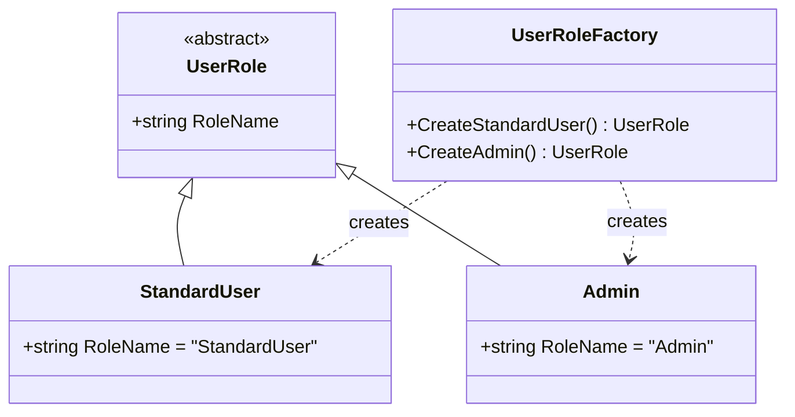

# Task 2.16-2.17: UserRole Discriminated Union

**Status**: ✅ Completed  
**Commit**: 3cbe4ed  
**Date**: 2025-10-10

---

## Overview

Implemented `UserRole` as a **discriminated union** to enable type-safe role management. This follows DDD principles of explicit, compiler-checked types instead of string literals.

---

## Implementation Details

### Architecture



### Components

#### 1. Abstract Base Record: `UserRole`

```csharp
public abstract record UserRole
{
    public abstract string RoleName { get; }
}
```

**Purpose**:

- Base for all role variants
- `RoleName` property for JWT claims/authorization
- Abstract → cannot be instantiated directly
- Enables exhaustive pattern matching

#### 2. Variants

**StandardUser** - Standard user role with basic permissions

```csharp
public sealed record StandardUser : UserRole
{
    public override string RoleName => nameof(StandardUser);
}
```

- RoleName = "StandardUser"
- Sealed → cannot be inherited

**Admin** - Administrator role with elevated permissions

```csharp
public sealed record Admin : UserRole
{
    public override string RoleName => nameof(Admin);
}
```

- RoleName = "Admin"
- Sealed → cannot be inherited

#### 3. Factory: `UserRoleFactory`**

```csharp
public static class UserRoleFactory
{
    public static UserRole CreateStandardUser()
    {
        UserRole role = new StandardUser();
        Debug.Assert(role is StandardUser, "Role should be StandardUser");
        Debug.Assert(role.RoleName == nameof(StandardUser), "RoleName should match type name");
        return role;
    }

    public static UserRole CreateAdmin()
    {
        UserRole role = new Admin();
        Debug.Assert(role is Admin, "Role should be Admin");
        Debug.Assert(role.RoleName == nameof(Admin), "RoleName should match type name");
        return role;
    }
}
```

**Responsibilities**:

- Controlled creation of role instances
- NASA assertions (min 2 per method):
  - Type verification (`is StandardUser` / `is Admin`)
  - RoleName validation with `nameof()`

---

## Architectural Decisions

### Why Discriminated Union instead of Enum or Static Instances?

#### Type Safety

- Compiler enforces exhaustive pattern matching
- Impossible states are unrepresentable
- Refactoring-safe

### 2. Extensibility

- New roles can be added as variants
- Each variant can have its own properties/methods
- No breaking changes to existing code

### 3. Encapsulation

- Each role encapsulates its own behavior
- Clear separation of concerns
- Single Responsibility Principle

### 4. Immutability

- Records are immutable by default
- Thread-safe
- Predictable behavior

### Why `nameof()` instead of String Literals?

```csharp
// ✅ Good - Refactoring-safe
public override string RoleName => nameof(StandardUser);

// ❌ Bad - Magic string
public override string RoleName => "StandardUser";
```

**Benefits**:

- **Refactoring-safe**: Rename is automatically updated
- **Compile-time checking**: Typos caught at compile time
- **No magic strings**: Follows C# coding standards
- **IDE support**: Find all references works

---

## Usage Patterns

### 1. Pattern Matching (Type-Safe)

```csharp
UserRole role = UserRoleFactory.CreateStandardUser();

string permission = role switch
{
    StandardUser => "BasicPermission",
    Admin => "ElevatedPermission",
    _ => throw new InvalidOperationException("Unknown role")
};
```

**Compiler enforcement**: All variants must be handled.

### 2. JWT Claims

```csharp
UserRole role = user.Role;
var claim = new Claim(ClaimTypes.Role, role.RoleName);
// claim.Value = "StandardUser" or "Admin"
```

**Use case**: Authorization in ASP.NET Core.

### 3. Authorization Guards

```csharp
if (currentUser.Role is Admin)
{
    // Admin-specific logic
    await DeleteUserAsync(userId);
}
```

**Type-safe**: No string comparisons required.

### 4. Policy-Based Authorization

```csharp
services.AddAuthorization(options =>
{
    options.AddPolicy("AdminOnly", policy =>
        policy.RequireRole(nameof(Admin)));
});
```

---

## Test Coverage

### 11 Tests - All Passing ✅

### Factory Methods (2 tests)

- `CreateStandardUser_ShouldReturnStandardUser`
- `CreateAdmin_ShouldReturnAdmin`

### RoleName Property (2 tests)

- `StandardUser_ShouldHaveCorrectRoleName`
- `Admin_ShouldHaveCorrectRoleName`

### Equality (3 tests)

- `StandardUser_AndAdmin_ShouldNotBeEqual`
- `Equality_WithSameStandardUser_ShouldBeEqual`
- `Equality_WithSameAdmin_ShouldBeEqual`

### Pattern Matching (2 tests)

- `PatternMatching_WithStandardUser_ShouldWork`
- `PatternMatching_WithAdmin_ShouldWork`

### Immutability (2 tests)

- `StandardUser_ShouldBeImmutable`
- `Admin_ShouldBeImmutable`

---

## Benefits

### 1. Compiler Enforcement

```csharp
// ✅ Compile-time error if case is missing
string GetPermission(UserRole role) => role switch
{
    StandardUser => "Basic",
    Admin => "Elevated",
    // Compiler error: not all code paths return a value
};
```

### 2. Readability

```csharp
// ✅ Clear and explicit
if (role is Admin) { }

// ❌ Unclear and error-prone
if (role == "Admin") { }
```

### 3. Maintainability

```csharp
// ✅ New role = new variant
public sealed record SuperAdmin : UserRole
{
    public override string RoleName => nameof(SuperAdmin);
}

// Compiler shows all places that need updating
```

### 4. Performance

- No runtime string comparisons for type checks
- Pattern matching is optimized by compiler
- Value equality is efficient (record)

---

## Integration Points

### Future Usage

**In User Entity** (Task 2.34)

```csharp
public sealed record User
{
    public UserId Id { get; init; }
    public Email Email { get; init; }
    public UserRole Role { get; init; } // ← UserRole here
    // ...
}
```

**In Authorization** (Task 5.0+)

```csharp
[Authorize(Roles = nameof(Admin))]
public IActionResult DeleteUser(Guid userId) { }
```

**In EF Core** (Task 4.18)

```csharp
// Value converter for UserRole
builder.Property(u => u.Role)
    .HasConversion(
        role => role.RoleName,
        value => value == nameof(Admin) 
            ? UserRoleFactory.CreateAdmin() 
            : UserRoleFactory.CreateStandardUser()
    );
```

---

## Related Documentation

- → [03-domain-driven-design.md](../03-domain-driven-design.md) - Discriminated unions
- → [11-domain-layer.md](../11-domain-layer.md) - Value objects
- → [21-factory-patterns.md](../21-factory-patterns.md) - Factory methods
- → [22-nasa-rules.md](../22-nasa-rules.md) - Assertions

---

## Files Changed

```bash
src/UserManagement.Domain/ValueObjects/UserRole.cs
tests/Tests.UserManagement.Domain/ValueObjects/UserRoleTests.cs
tasks/tasks-0001-prd-register-user.md
```
