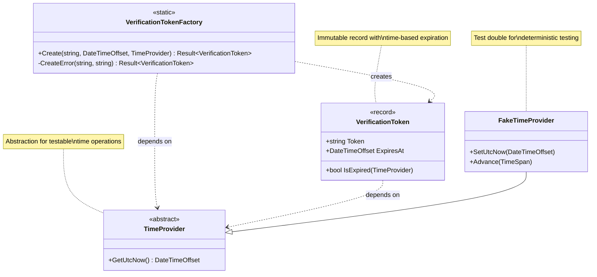

# Task 2.18-2.19: VerificationToken Value Object

**Status:** ✅ Completed  
**Commit:** TBD  
**Related:** [PRD-0001](../../../tasks/0001-prd-register-user.md), [Tasks](../../../tasks/tasks-0001-prd-register-user.md)

---

## Overview

Implementation of the `VerificationToken` value object for email verification. This immutable record encapsulates a verification token string and its expiration timestamp, with time-based validation using dependency injection of `TimeProvider`.

**Key Design Decision:** Uses `TimeProvider` dependency injection instead of `DateTime.UtcNow` to enable deterministic testing and prevent flaky time-based tests.

---

## Architecture Diagram



---

## Components

### 1. VerificationToken Record

**File:** `src/UserManagement.Domain/ValueObjects/VerificationToken.cs`

**Responsibilities:**

- Store verification token string
- Store expiration timestamp
- Provide expiration checking logic

**Properties:**

- `Token: string` - Unique token identifier (typically GUID or cryptographic random string)
- `ExpiresAt: DateTimeOffset` - UTC timestamp when token expires

**Methods:**

- `IsExpired(TimeProvider timeProvider): bool` - Checks if token has expired using injected time provider

**Characteristics:**

- Immutable record type
- Primary constructor syntax
- Time validation requires `TimeProvider` dependency
- No parameterless constructor (must use factory)

### 2. VerificationTokenFactory

**File:** Same file as `VerificationToken`

**Responsibilities:**

- Validate token string (not null/empty/whitespace)
- Validate expiration is in the future
- Create valid `VerificationToken` instances
- Enforce NASA assertions (minimum 2 per method)

**Factory Method:**

```csharp
public static Result<VerificationToken> Create(
    string token, 
    DateTimeOffset expiresAt, 
    TimeProvider timeProvider)
```

**Validation Rules:**

1. Token must not be null, empty, or whitespace
2. ExpiresAt must be in the future (relative to TimeProvider.GetUtcNow())

**Error Codes:**

- `TOKEN.Validation` - Token is null, empty, or whitespace
- `EXPIRESAT.Validation` - Expiration is not in the future

**NASA Assertions:**

- Post-creation: Token must not be empty
- Post-creation: ExpiresAt must be in the future
- Result assertions: Success result must have IsSuccess = true
- Result assertions: Success result value must match created token

---

## Architectural Decisions

### Why TimeProvider Dependency Injection?

**Problem:** Direct use of `DateTime.UtcNow` or `DateTimeOffset.UtcNow` makes code:

- Non-deterministic (tests fail at different times)
- Untestable (cannot control time in tests)
- Flaky (race conditions with millisecond timing)

**Solution:** Inject `TimeProvider` abstraction:

```csharp
// ❌ BAD: Non-testable
public bool IsExpired() => DateTimeOffset.UtcNow >= ExpiresAt;

// ✅ GOOD: Testable
public bool IsExpired(TimeProvider timeProvider) 
    => timeProvider.GetUtcNow() >= ExpiresAt;
```

**Benefits:**

1. **Deterministic Testing:** Use `FakeTimeProvider` with fixed time
2. **Time Travel:** Advance time in tests without `Thread.Sleep()`
3. **No Flaky Tests:** Tests always use same baseline time
4. **Production Code:** Use `TimeProvider.System` for real time

### Why Fixed Baseline in Tests?

**Implementation:**

```csharp
private static readonly DateTimeOffset BaselineTime = 
    new(2025, 10, 10, 12, 0, 0, TimeSpan.Zero);

private readonly FakeTimeProvider _timeProvider = new(BaselineTime);
```

**Benefits:**

- Tests pass regardless of when executed (2025, 2030, 2050)
- No dependency on current system time
- Predictable time arithmetic (24 hours from baseline)
- Easier debugging (known time values)

### Why Record Type?

- **Value Semantics:** Equality based on content, not identity
- **Immutability:** Cannot modify after creation (thread-safe)
- **Conciseness:** Primary constructor reduces boilerplate
- **Pattern Matching:** Works with switch expressions

---

## Usage Patterns

### 1. Creating Verification Tokens

```csharp
TimeProvider timeProvider = TimeProvider.System; // or inject via DI
DateTimeOffset expiresAt = timeProvider.GetUtcNow().AddHours(24);
string token = Guid.NewGuid().ToString();

Result<VerificationToken> result = VerificationTokenFactory.Create(
    token, 
    expiresAt, 
    timeProvider
);

if (result.IsSuccess)
{
    VerificationToken verificationToken = result.Value;
    // Use token...
}
```

### 2. Checking Expiration

```csharp
VerificationToken token = // ... from database or request
TimeProvider timeProvider = // ... from DI

if (token.IsExpired(timeProvider))
{
    // Token has expired, send new verification email
    return Result.Failure(ErrorFactory.Validation(
        nameof(VerificationToken),
        "Verification token has expired"
    ));
}

// Token is still valid, proceed with verification
```

### 3. Email Verification Status (Future Integration)

```csharp
// Will be used in EmailVerificationStatus discriminated union
public sealed record NotVerified(VerificationToken Token) : EmailVerificationStatus;

public sealed record Expired(VerificationToken ExpiredToken) : EmailVerificationStatus;
```

### 4. Testing with FakeTimeProvider

```csharp
// Arrange
var baselineTime = new DateTimeOffset(2025, 10, 10, 12, 0, 0, TimeSpan.Zero);
var fakeTimeProvider = new FakeTimeProvider(baselineTime);
string token = Guid.NewGuid().ToString();
DateTimeOffset expiresAt = baselineTime.AddHours(1);

// Act
Result<VerificationToken> result = VerificationTokenFactory.Create(
    token, 
    expiresAt, 
    fakeTimeProvider
);

// Assert - Token not expired yet
result.Value.IsExpired(fakeTimeProvider).Should().BeFalse();

// Time travel: Advance 2 hours
fakeTimeProvider.Advance(TimeSpan.FromHours(2));

// Assert - Token now expired
result.Value.IsExpired(fakeTimeProvider).Should().BeTrue();
```

---

## Test Coverage

**File:** `tests/Tests.UserManagement.Domain/ValueObjects/VerificationTokenTests.cs`

**Total Tests:** 12

### Test Categories

#### ✅ Factory Method Tests (4 tests)

1. `Create_WithValidTokenAndExpiration_ShouldSucceed`
   - Valid token and future expiration
   - Verifies Token and ExpiresAt properties

2. `Create_WithEmptyToken_ShouldFail`
   - Empty string token
   - Error code: `TOKEN.Validation`

3. `Create_WithWhitespaceToken_ShouldFail`
   - Whitespace-only token
   - Error code: `TOKEN.Validation`

4. `Create_WithNullToken_ShouldFail`
   - Null token parameter
   - Error code: `TOKEN.Validation`

#### ✅ Validation Tests (2 tests)

1. `Create_WithExpirationInPast_ShouldFail`
   - ExpiresAt before current time
   - Error code: `EXPIRESAT.Validation`

2. `Create_WithVeryLongToken_ShouldSucceed`
   - Token with 500 characters
   - No length limitation (delegated to database schema)

#### ✅ Expiration Logic Tests (2 tests)

1. `IsExpired_WhenExpirationInFuture_ShouldReturnFalse`
   - Token valid for 24 hours from baseline
   - Uses FakeTimeProvider at baseline time

2. `IsExpired_WhenExpirationInPast_ShouldReturnTrue`
   - Token expires in 1 hour
   - FakeTimeProvider advances 2 hours
   - Demonstrates time travel testing

#### ✅ Record Equality Tests (3 tests)

1. `RecordEquality_WithSameValues_ShouldBeEqual`
   - Two tokens with identical values
   - Structural equality (not reference)

2. `RecordEquality_WithDifferentTokens_ShouldNotBeEqual`
    - Same expiration, different token strings
    - Value semantics

3. `RecordEquality_WithDifferentExpirations_ShouldNotBeEqual`
    - Same token, different expirations
    - All properties contribute to equality

#### ✅ Immutability Test (1 test)

1. `Immutability_TokenAndExpiresAtShouldBeReadOnly`
    - Properties cannot be modified after creation
    - Record init-only properties

---

## Integration Points

### Current Usage

- **None yet** - Value object ready for use

### Future Usage (Upcoming Tasks)

#### 1. EmailVerificationStatus Discriminated Union (Task 2.22-2.24)

```csharp
public abstract record EmailVerificationStatus;

public sealed record NotVerified(VerificationToken Token) 
    : EmailVerificationStatus;

public sealed record Verified(DateTimeOffset VerifiedOn) 
    : EmailVerificationStatus;

public sealed record Expired(VerificationToken ExpiredToken) 
    : EmailVerificationStatus;
```

#### 2. User Entity (Task 2.33-2.41)

```csharp
public sealed record User
{
    public EmailVerificationStatus VerificationStatus { get; init; }
    // ... other properties
    
    public Result VerifyEmail(TimeProvider timeProvider)
    {
        if (VerificationStatus is NotVerified(var token) 
            && token.IsExpired(timeProvider))
        {
            return Result.Failure(ErrorFactory.Validation(
                nameof(VerificationStatus),
                "Verification token has expired"
            ));
        }
        
        // Set status to Verified
        // ...
    }
}
```

#### 3. RegisterUserHandler (Task 3.34-3.42)

```csharp
public class RegisterUserHandler
{
    private readonly TimeProvider _timeProvider;
    
    public RegisterUserHandler(TimeProvider timeProvider)
    {
        _timeProvider = timeProvider;
    }
    
    public async Task<Result<RegisterUserResponse>> Handle(
        RegisterUserRequest request)
    {
        // Generate token
        string token = GenerateSecureToken();
        DateTimeOffset expiresAt = _timeProvider.GetUtcNow().AddHours(24);
        
        Result<VerificationToken> tokenResult = 
            VerificationTokenFactory.Create(token, expiresAt, _timeProvider);
        
        // Create user with NotVerified status
        // ...
    }
}
```

#### 4. EF Core Configuration (Task 4.14-4.25)

```csharp
public class UserConfiguration : IEntityTypeConfiguration<User>
{
    public void Configure(EntityTypeBuilder<User> builder)
    {
        // Owned entity for EmailVerificationStatus
        builder.OwnsOne(u => u.VerificationStatus, status =>
        {
            status.Property<string>("Discriminator");
            
            // For NotVerified variant
            status.OwnsOne(
                "Token", 
                token =>
                {
                    token.Property<string>("Token").HasMaxLength(500);
                    token.Property<DateTimeOffset>("ExpiresAt");
                }
            );
        });
    }
}
```

---

## Benefits

### 1. **Testability**

- `TimeProvider` abstraction enables deterministic tests
- `FakeTimeProvider` allows time travel without delays
- Fixed baseline time prevents test failures over time

### 2. **Type Safety**

- Cannot accidentally pass raw strings as tokens
- Expiration always validated at creation
- Compiler enforces `TimeProvider` dependency

### 3. **Immutability**

- Thread-safe (no mutation after creation)
- Predictable behavior (no hidden state changes)
- Safe to share across threads

### 4. **Validation at Creation**

- Invalid tokens cannot exist in the system
- Railway-Oriented Programming prevents error propagation
- Clear error messages for debugging

### 5. **NASA Assertions**

- Minimum 2 assertions per factory method
- Post-condition verification
- Early detection of logic errors

### 6. **No Flaky Tests**

- Fixed baseline time (2025-10-10 12:00:00 UTC)
- No dependency on system clock
- Tests pass in 2025, 2030, 2050+

---

## Related Documentation

- [Clean Architecture Overview](../00-clean-architecture.md)
- [Railway-Oriented Programming](../20-railway-oriented-programming.md)
- [Value Objects Pattern](../21-value-objects.md)
- [Factory Pattern](../22-factory-pattern.md)
- [Test-Driven Development](../23-test-driven-development.md)
- [UserRole Implementation](./2.16-2.17-userrole.md)
- [Email Value Object](./2.08-2.11-email.md)

---

## Summary

The `VerificationToken` value object demonstrates:

- **Dependency Injection:** `TimeProvider` for testable time operations
- **Deterministic Testing:** `FakeTimeProvider` with fixed baseline
- **Railway-Oriented Programming:** `Result<VerificationToken>` for error handling
- **Value Object Pattern:** Immutable record with validation
- **Factory Pattern:** Centralized creation with NASA assertions
- **Type Safety:** Compiler-enforced constraints

**Key Takeaway:** Using `TimeProvider` instead of `DateTime.UtcNow` makes time-dependent logic fully testable and prevents flaky tests. The fixed baseline time ensures tests pass indefinitely.
