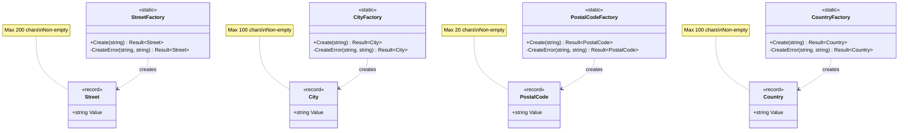

# Task 2.20-2.21: Address Component Value Objects

**Status:** ✅ Completed  
**Commit:** TBD  
**Related:** [PRD-0001](../../../tasks/0001-prd-register-user.md), [Tasks](../../../tasks/tasks-0001-prd-register-user.md)

---

## Overview

Implementation of four address component value objects (`Street`, `City`, `PostalCode`, `Country`) that encapsulate and validate individual address fields. These immutable records ensure that invalid address data cannot exist in the system.

**Key Design:** Simple string-based value objects with length validation and immutability, following the same pattern as `Name` value object.

---

## Architecture Diagram



---

## Components

### 1. Street Value Object

**File:** `src/UserManagement.Domain/ValueObjects/AddressComponents/Street.cs`

**Responsibilities:**

- Encapsulate street address (street name + house number)
- Validate non-empty
- Validate maximum length (200 characters)

**Properties:**

- `Value: string` - Street address with house number

**Validation Rules:**

- Cannot be null, empty, or whitespace
- Maximum length: 200 characters

**Error Codes:**

- `VALUE.Validation` - Empty or too long

**Examples:**

- ✅ Valid: `"Main Street 123"`, `"Rue de l'Église 42"`, `"123 Main St."`
- ❌ Invalid: `""`, `"   "`, `new string('a', 201)`

### 2. City Value Object

**File:** `src/UserManagement.Domain/ValueObjects/AddressComponents/City.cs`

**Responsibilities:**

- Encapsulate city name
- Validate non-empty
- Validate maximum length (100 characters)

**Properties:**

- `Value: string` - City name

**Validation Rules:**

- Cannot be null, empty, or whitespace
- Maximum length: 100 characters

**Error Codes:**

- `VALUE.Validation` - Empty or too long

**Examples:**

- ✅ Valid: `"New York"`, `"São Paulo"`, `"Baden-Baden"`
- ❌ Invalid: `""`, `"   "`, `new string('a', 101)`

### 3. PostalCode Value Object

**File:** `src/UserManagement.Domain/ValueObjects/AddressComponents/PostalCode.cs`

**Responsibilities:**

- Encapsulate postal/ZIP code
- Validate non-empty
- Validate maximum length (20 characters)
- Support various international formats

**Properties:**

- `Value: string` - Postal code (various formats)

**Validation Rules:**

- Cannot be null, empty, or whitespace
- Maximum length: 20 characters
- **No format validation** - supports all international formats

**Error Codes:**

- `VALUE.Validation` - Empty or too long

**Examples:**

- ✅ Valid: `"12345"` (US), `"10115"` (DE), `"SW1A 1AA"` (UK), `"K1A 0B1"` (CA)
- ❌ Invalid: `""`, `"   "`, `new string('1', 21)`

### 4. Country Value Object

**File:** `src/UserManagement.Domain/ValueObjects/AddressComponents/Country.cs`

**Responsibilities:**

- Encapsulate country name
- Validate non-empty
- Validate maximum length (100 characters)

**Properties:**

- `Value: string` - Country name

**Validation Rules:**

- Cannot be null, empty, or whitespace
- Maximum length: 100 characters
- **No ISO code validation** - stores full country names

**Error Codes:**

- `VALUE.Validation` - Empty or too long

**Examples:**

- ✅ Valid: `"United States"`, `"Germany"`, `"Côte d'Ivoire"`
- ❌ Invalid: `""`, `"   "`, `new string('a', 101)`

---

## Architectural Decisions

### Why Separate Value Objects Instead of Primitive Strings?

**Problem with Primitives:**

```csharp
// ❌ BAD: Primitive obsession
public class Address
{
    public string Street { get; set; }
    public string City { get; set; }
    public string PostalCode { get; set; }
    public string Country { get; set; }
}

// Can assign invalid values:
address.Street = ""; // Empty!
address.City = new string('x', 500); // Too long!
```

**Solution with Value Objects:**

```csharp
// ✅ GOOD: Value objects with validation
public class Address
{
    public Street Street { get; init; }
    public City City { get; init; }
    public PostalCode PostalCode { get; init; }
    public Country Country { get; init; }
}

// Invalid states are unrepresentable:
Result<Street> result = StreetFactory.Create(""); // Returns Failure
```

**Benefits:**

1. **Type Safety:** Cannot pass city where street is expected
2. **Validation Encapsulation:** Logic lives with data
3. **Self-Documenting:** Clear intent in type names
4. **Refactoring Safety:** Change validation in one place
5. **Domain Language:** Speaks the language of the domain

### Why No Format Validation for PostalCode?

**Decision:** Store as string without regex validation

**Rationale:**

- International postal codes have vastly different formats:
  - US: `12345` or `12345-6789`
  - Germany: `10115`
  - UK: `SW1A 1AA`
  - Canada: `K1A 0B1`
  - Netherlands: `1234 AB`
- Regex validation would be:
  - Complex (dozens of country-specific patterns)
  - Brittle (changes when countries update formats)
  - Incomplete (cannot cover all edge cases)
- Better approach:
  - Store as-is
  - Validate length only (20 chars covers all known formats)
  - Use external address validation service if needed
  - Trust user input for international addresses

### Why Store Country Names Instead of ISO Codes?

**Decision:** Store full country names (e.g., "Germany") not ISO codes (e.g., "DE")

**Rationale:**

- **User-Facing:** Easier to read in database and logs
- **Flexibility:** Can handle historical countries, territories, regions
- **No Lookups:** No need for country code → name mapping
- **Simplicity:** One string field, no foreign key
- **Future-Proof:** If ISO codes change, no data migration needed

**Trade-offs:**

- More storage (avg ~15 bytes vs 2 bytes)
- Potential inconsistency (e.g., "USA" vs "United States")
- No built-in validation (can't check against ISO 3166 list)

**Mitigation:**

- Use dropdown in UI to ensure consistent naming
- Store canonical names (e.g., always "United States", never "USA")
- Add CHECK constraint in database if needed

### Why Same Validation Pattern for All Four?

**Consistency Benefits:**

- **Predictable API:** All use `*Factory.Create(string)`
- **Easy Testing:** Same test structure for all
- **Simple Maintenance:** Change one, understand all
- **Cognitive Load:** One pattern to remember

**Implementation:**

```csharp
// All follow this pattern:
public static Result<T> Create(string value)
{
    if (string.IsNullOrWhiteSpace(value))
        return CreateError(nameof(T.Value), "T cannot be empty");
    
    if (value.Length > MaxLength)
        return CreateError(nameof(T.Value), "T cannot exceed maximum length of MaxLength characters");
    
    T instance = new(value);
    
    // NASA assertions (min 2)
    Debug.Assert(!string.IsNullOrWhiteSpace(instance.Value), "...");
    Debug.Assert(instance.Value.Length <= MaxLength, "...");
    
    return ResultFactory.Success(instance);
}
```

---

## Usage Patterns

### 1. Creating Address Components

```csharp
// Individual component creation
Result<Street> streetResult = StreetFactory.Create("Main Street 123");
Result<City> cityResult = CityFactory.Create("New York");
Result<PostalCode> postalCodeResult = PostalCodeFactory.Create("10001");
Result<Country> countryResult = CountryFactory.Create("United States");

// Check all results
if (streetResult.IsFailure)
    return streetResult.Error;
    
if (cityResult.IsFailure)
    return cityResult.Error;
    
// ... etc
```

### 2. Railway-Oriented Composition (Future)

```csharp
// When Address entity is implemented (Task 2.25-2.28)
public static class AddressFactory
{
    public static Result<Address> Create(
        string street,
        string city,
        string postalCode,
        string country)
    {
        // Validate all components first
        Result<Street> streetResult = StreetFactory.Create(street);
        if (streetResult.IsFailure) return Result<Address>.Failure(streetResult.Error);
        
        Result<City> cityResult = CityFactory.Create(city);
        if (cityResult.IsFailure) return Result<Address>.Failure(cityResult.Error);
        
        Result<PostalCode> postalCodeResult = PostalCodeFactory.Create(postalCode);
        if (postalCodeResult.IsFailure) return Result<Address>.Failure(postalCodeResult.Error);
        
        Result<Country> countryResult = CountryFactory.Create(country);
        if (countryResult.IsFailure) return Result<Address>.Failure(countryResult.Error);
        
        // All valid - create address
        Address address = new(
            AddressId.New(),
            streetResult.Value,
            cityResult.Value,
            postalCodeResult.Value,
            countryResult.Value
        );
        
        return Result<Address>.Success(address);
    }
}
```

### 3. Using in Address Entity (Future)

```csharp
// Future Address entity (Task 2.25-2.28)
public sealed record Address
{
    public AddressId Id { get; init; }
    public Street Street { get; init; }
    public City City { get; init; }
    public PostalCode PostalCode { get; init; }
    public Country Country { get; init; }
    
    // Null Object Pattern
    public static readonly Address Empty = new(
        AddressId.Empty(),
        StreetFactory.Create("N/A").Value,  // Will use special Empty instances
        CityFactory.Create("N/A").Value,
        PostalCodeFactory.Create("N/A").Value,
        CountryFactory.Create("N/A").Value
    );
    
    public bool IsEmpty => Id == AddressId.Empty();
}
```

### 4. EF Core Value Conversion (Future)

```csharp
// Future EF Core configuration (Task 4.14-4.25)
public class AddressConfiguration : IEntityTypeConfiguration<Address>
{
    public void Configure(EntityTypeBuilder<Address> builder)
    {
        // Street
        builder.Property(a => a.Street)
            .HasConversion(
                street => street.Value,
                value => StreetFactory.Create(value).Value  // Assumes valid
            )
            .HasMaxLength(200);
        
        // City
        builder.Property(a => a.City)
            .HasConversion(
                city => city.Value,
                value => CityFactory.Create(value).Value
            )
            .HasMaxLength(100);
        
        // PostalCode
        builder.Property(a => a.PostalCode)
            .HasConversion(
                code => code.Value,
                value => PostalCodeFactory.Create(value).Value
            )
            .HasMaxLength(20);
        
        // Country
        builder.Property(a => a.Country)
            .HasConversion(
                country => country.Value,
                value => CountryFactory.Create(value).Value
            )
            .HasMaxLength(100);
    }
}
```

---

## Test Coverage

**Total Tests:** 41 (10-11 tests per component)

### Street Tests (10 tests)

**File:** `tests/Tests.UserManagement.Domain/ValueObjects/AddressComponents/StreetTests.cs`

1. ✅ `Create_WithValidStreet_ShouldSucceed`
2. ✅ `Create_WithEmptyStreet_ShouldFail`
3. ✅ `Create_WithWhitespaceStreet_ShouldFail`
4. ✅ `Create_WithTooLongStreet_ShouldFail` (201 chars)
5. ✅ `Create_WithMaxLengthStreet_ShouldSucceed` (200 chars)
6. ✅ `RecordEquality_WithSameValues_ShouldBeEqual`
7. ✅ `RecordEquality_WithDifferentValues_ShouldNotBeEqual`
8. ✅ `Immutability_ValueShouldBeReadOnly`
9. ✅ `Create_WithSpecialCharacters_ShouldSucceed` (`"Rue de l'Église 42"`)
10. ✅ `Create_WithNumbers_ShouldSucceed` (`"123 Main St."`)

### City Tests (10 tests)

**File:** `tests/Tests.UserManagement.Domain/ValueObjects/AddressComponents/CityTests.cs`

1. ✅ `Create_WithValidCity_ShouldSucceed`
2. ✅ `Create_WithEmptyCity_ShouldFail`
3. ✅ `Create_WithWhitespaceCity_ShouldFail`
4. ✅ `Create_WithTooLongCity_ShouldFail` (101 chars)
5. ✅ `Create_WithMaxLengthCity_ShouldSucceed` (100 chars)
6. ✅ `RecordEquality_WithSameValues_ShouldBeEqual`
7. ✅ `RecordEquality_WithDifferentValues_ShouldNotBeEqual`
8. ✅ `Immutability_ValueShouldBeReadOnly`
9. ✅ `Create_WithSpecialCharacters_ShouldSucceed` (`"São Paulo"`)
10. ✅ `Create_WithHyphens_ShouldSucceed` (`"Baden-Baden"`)

### PostalCode Tests (11 tests)

**File:** `tests/Tests.UserManagement.Domain/ValueObjects/AddressComponents/PostalCodeTests.cs`

1. ✅ `Create_WithValidPostalCode_ShouldSucceed`
2. ✅ `Create_WithEmptyPostalCode_ShouldFail`
3. ✅ `Create_WithWhitespacePostalCode_ShouldFail`
4. ✅ `Create_WithTooLongPostalCode_ShouldFail` (21 chars)
5. ✅ `Create_WithMaxLengthPostalCode_ShouldSucceed` (20 chars)
6. ✅ `RecordEquality_WithSameValues_ShouldBeEqual`
7. ✅ `RecordEquality_WithDifferentValues_ShouldNotBeEqual`
8. ✅ `Immutability_ValueShouldBeReadOnly`
9. ✅ `Create_WithGermanPostalCode_ShouldSucceed` (`"10115"`)
10. ✅ `Create_WithUKPostalCode_ShouldSucceed` (`"SW1A 1AA"`)
11. ✅ `Create_WithCanadianPostalCode_ShouldSucceed` (`"K1A 0B1"`)

### Country Tests (10 tests)

**File:** `tests/Tests.UserManagement.Domain/ValueObjects/AddressComponents/CountryTests.cs`

1. ✅ `Create_WithValidCountry_ShouldSucceed`
2. ✅ `Create_WithEmptyCountry_ShouldFail`
3. ✅ `Create_WithWhitespaceCountry_ShouldFail`
4. ✅ `Create_WithTooLongCountry_ShouldFail` (101 chars)
5. ✅ `Create_WithMaxLengthCountry_ShouldSucceed` (100 chars)
6. ✅ `RecordEquality_WithSameValues_ShouldBeEqual`
7. ✅ `RecordEquality_WithDifferentValues_ShouldNotBeEqual`
8. ✅ `Immutability_ValueShouldBeReadOnly`
9. ✅ `Create_WithGermany_ShouldSucceed`
10. ✅ `Create_WithSpecialCharacters_ShouldSucceed` (`"Côte d'Ivoire"`)

---

## Integration Points

### Current Usage

- **None yet** - Value objects ready for use

### Future Usage (Upcoming Tasks)

#### 1. Address Entity (Task 2.25-2.28)

```csharp
public sealed record Address
{
    public AddressId Id { get; init; }
    public Street Street { get; init; }
    public City City { get; init; }
    public PostalCode PostalCode { get; init; }
    public Country Country { get; init; }
    
    public static readonly Address Empty = /* Null Object Pattern */;
    public bool IsEmpty { get; }
}
```

#### 2. UserProfile Entity (Task 2.29-2.32)

```csharp
public sealed record UserProfile
{
    public UserProfileId Id { get; init; }
    public Address Address { get; init; }  // Uses AddressComponents internally
    
    public bool HasAddress() => !Address.IsEmpty;
}
```

#### 3. EF Core Configuration (Task 4.14-4.25)

- Value Converters for each component (string ↔ ValueObject)
- Column length constraints (200, 100, 20, 100)
- NULL mapping for Address.Empty

---

## Benefits

### 1. **Type Safety**

- Compiler prevents mixing street/city/postal code
- Cannot pass wrong string to wrong parameter
- Refactoring tools work correctly

### 2. **Validation Encapsulation**

- Validation logic lives with the data
- Cannot create invalid instances
- DRY: Validation in one place only

### 3. **Domain Language**

- Code speaks the language of the domain
- Clear intent: `Street` not `string`
- Self-documenting API

### 4. **Immutability**

- Thread-safe (no mutation after creation)
- Predictable behavior
- Safe to share across boundaries

### 5. **NASA Assertions**

- Minimum 2 assertions per factory
- Post-condition verification
- Early detection of logic errors

### 6. **International Support**

- PostalCode: No format restrictions (supports all countries)
- City/Country: Unicode support (São Paulo, Côte d'Ivoire)
- Flexible length limits

---

## Related Documentation

- [Clean Architecture Overview](../00-clean-architecture.md)
- [Railway-Oriented Programming](../20-railway-oriented-programming.md)
- [Value Objects Pattern](../21-value-objects.md)
- [Factory Pattern](../22-factory-pattern.md)
- [Test-Driven Development](../23-test-driven-development.md)
- [Name Value Object](./2.12-2.13-name.md)
- [Email Value Object](./2.08-2.11-email.md)

---

## Summary

The **Address Component Value Objects** demonstrate:

- **Simple Value Objects:** Single `Value` property with validation
- **Consistent Pattern:** All four follow identical structure
- **Type Safety:** Cannot mix different address components
- **International Support:** No format restrictions for postal codes
- **Railway-Oriented Programming:** `Result<T>` for error handling
- **Factory Pattern:** Centralized creation with NASA assertions

**Key Takeaway:** Four small, focused value objects are better than one large `Address` record with primitive strings. Each component can be validated, tested, and evolved independently.

**Total Implementation:**

- 4 Value Objects (Street, City, PostalCode, Country)
- 4 Factory classes with validation
- 41 comprehensive tests
- All 144 tests passing
